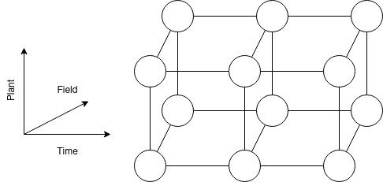
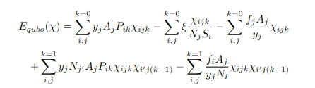
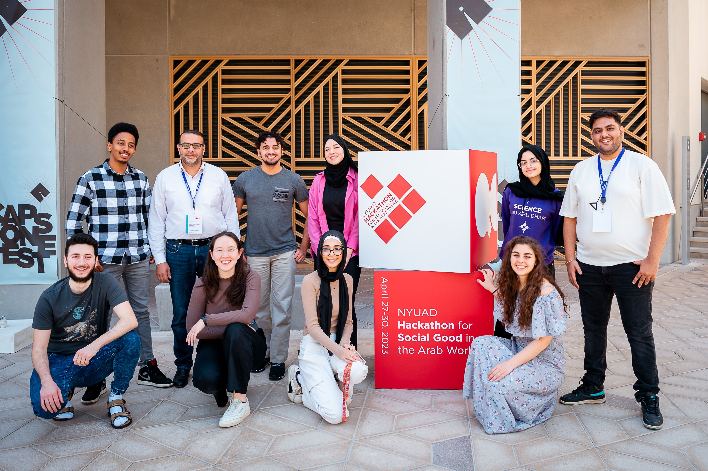

# AqriCult

## Overview 
Welocome to our project developed for the NYUAD Quantum Computing Hackathon for Social Good!

AqriCult is a crop rotation quantum optimizer targeting specifically UAE's agriculture. Crop rotation is the practice of planting different crops sequentially on the same plot of land in order to improve soil health, optimize nutrients in the soil, and combat pest and weed pressure. The algorithm makes predictions on optimal distribution of several crops that a argriculturist has chosen to plant for a given amount of years or seasons.

When it comes to the quantum advantage of our solution against the many available AI solutions in the market, AqriCult can work on a bigger scale and in a greater detail which can be implemented in cases such as government planning or industrial-size plantations.

AqriCult bases its predictions on market demand and predicted financial gains, soil quality, and environment factors, aiming better use of the land, higher food satisfaction, and positive impact on the nature, while maximizing farmers' revenue. The market demand is evaluated using an ML model we have developed during the hackathon which makes predictions on the price of the crop which is chosen.

## Algorithm
### Parameters
The parameters that the algorithm takes into account are soil quality, environment, market demand, aiming maximum revenue.

### Mathematical representation
We model the crop distribution problem over the years in a 3D space consisting of the plant, field it should be planted on and the time (years/seasons).

On the image above a model for two plants, distributed on two fields over three years time period is provided as an example. The cost fucntion modelling the problem is depicted on the second image.
where:
- $y_j$ - yield constant of field $j$;
- $A_j$ - area of field $j$;
- $P_{ik}$ - profit of plant $i$ at time $k$;
- $N_{f_i}$ - plant impact of $i$;
- $f_{r_i}$ - fertilizer requirement of $i$ * fertilizer cost;
- and $\xi$ - environment coefficient.

### Technologies
We gather information from [investing.com/commodities](investing.com/commodities) and based on that data we have trained an ARIMA (Autoregressive Integrated Moving Average) model to predict the prices of the crop which is used.

## Setup
You can launch the project on [qBraid](qbraid.com) with the button in the beginning of this file. 

## Team

Nada Elsharkawy, Mojtaba Khavaninzadeh, Violeta Kabadzhova, Nada Boutaoui، Mira Saleh، Amine Kidane، Sophie Li، Swaraj Purohit، Ahmad Alsadeh (Mentor)، Salahedeen Issa (Mentor)
